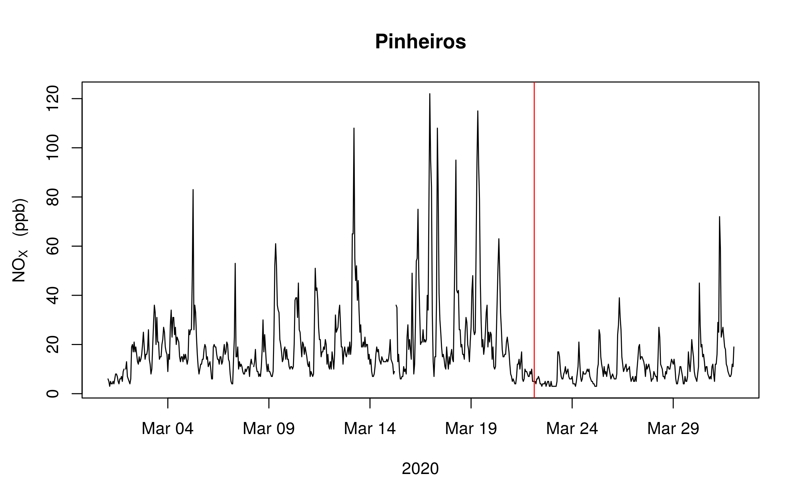
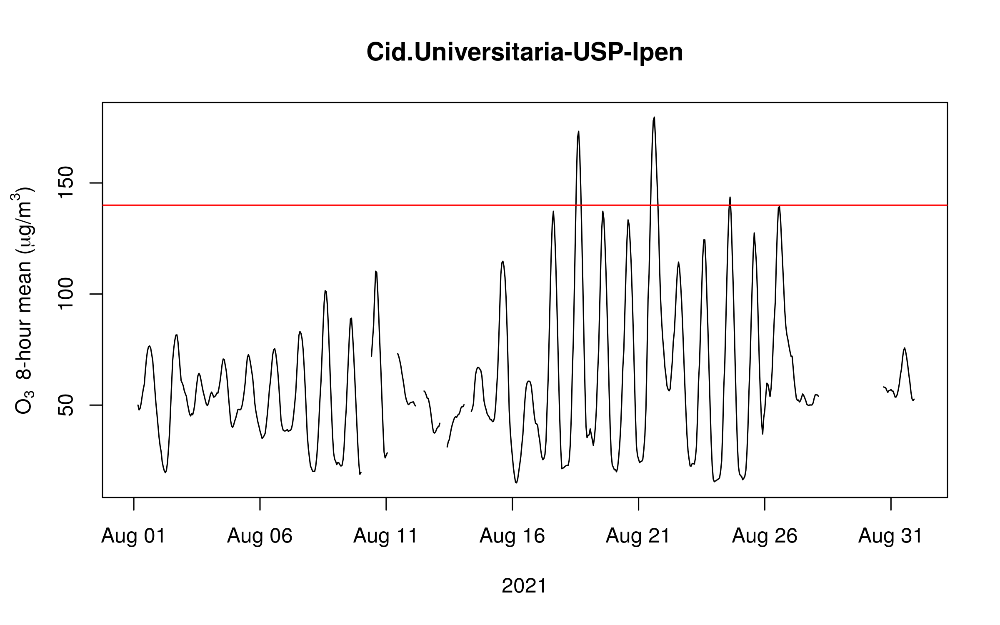

# Summary
`qualR` is an R package to download air pollution data from the State of São Paulo and the city of Rio de Janeiro.
It produces completed data frames (i.e. missing hours padded out with `NA`) with a `date` column in `POSIXct` that facilitates temporal aggregation.
`qualR` positively impacts research by allowing easy and fast data analysis and code reproducibility.

# Statement of Need
Air quality networks provide air pollutant concentration for a given time and space.
This information is used to monitor the state of the atmosphere and to verify air quality models [@Seinfeld2016].
Brazil has two of the most extensive air quality networks in South America [@Riojas-Rodriguez2016].
The first network is located in the State of São Paulo.
It has more than 50 air quality stations (AQS)
that also monitors the Metropolitan Area of São Paulo,
the largest megacity of South America.
The second air quality network is located in the State of Rio de Janeiro.
Currently, the city of Rio de Janeiro is monitored by a network of eight AQS.

[The São Paulo Environmental Agency (CETESB)](https://cetesb.sp.gov.br/ar/) manages the state air quality network and distributes the information through the [QUALAR System](https://qualar.cetesb.sp.gov.br/qualar/home.do).
To use QUALAR, you first need to create an [account](https://seguranca.cetesb.sp.gov.br/Home/CadastrarUsuario) to be able to manually download the measurements.
QUALAR allows downloading one parameter for one AQS in the simple query option,
or at least three parameters for one AQS in the advanced query option.
The download is limited to one year of data for each query.
The original QUALAR data is a comma-separated values file (CSV) that requires pre-processing.
Typical pre-preocessing tasks include: completing missing dates (i.e. missing hours due to equipment calibration or malfunction),
changing the decimal separator, and changing the date format to perform temporal analysis.
Regarding the city of Rio de Janeiro, the [Monitor Ar Program](https://www.rio.rj.gov.br/web/smac/monitorar-rio1),
offers the measurements through the [data.rio API](https://www.data.rio/datasets/dados-hor%C3%A1rios-do-monitoramento-da-qualidade-do-ar-monitorar).
It is not so user-friendly,
and the information also needs the pre-processing.

The data from CETESB and Monitor Ar program is used in environmental research [@Andrade2017], in
model evaluation [@Gavidia-Calderon2018], and in pollutant exposure studies [@Dantas2020].
Given that 80 % of the time in data analysis is spent in data preparation [@Dasu2003],
We create `qualR` to accelerate it.
`qualR` is an R package for producing high-quality data ready for analysis.

`qualR` allows the user to download of multiple parameters and multiple years per AQS,
and by using R loops, it can easily download many AQS.
It is built in R [@RCoreTeam2020], using the XML [@XML], httr [@httr], and jsonlite [@Ooms]  packages.
`qualR` handles missing date hours by assigning `NA` values,
ensuring a complete dataset.
All `qualR` functions return data frames with a `date` column in `POSIXct` type.
This ensures compatibility with robust air pollution analysis packages like
`openair` [@Carslaw2012].
The `qualR` functions allow exporting the data in a CSV file for compatibility with other software tools.
The `qualR` package improves research by producing high-quality datasets easily,
enabling exploratory data analysis, and fostering reproducibility.


# Functions and datasets
`qualR` has 8 functions:

| Function                 | Description                                                                        |
| ------------------------ | ---------------------------------------------------------------------------------- |
| CetesbRetrieveParam      | Download a list of parameters from one CETESB  AQS                                 |
| CetesbRetrievePol        | Download criteria pollutants from one CETESB AQS                                   |
| CetesbRetrieveMet        | Download meteorological parameters from one CETESB AQS                             |
| CetesbRetrieveMetPol     | Download criteria pollutants and meteorological parameters from one CETESB AQS     |
| MonitorArRetrieveParam   | Download a list of parameters from one Monitor Ar AQS                              |
| MonitorArRetrievePol     | Download criteria pollutants from one Monitor Ar AQS                               |
| MonitorArRetrieveMet     | Download meteorological parameters from one Monitor Ar AQS                         |
| MonitorArRetrieveMetPol  | Download criteria pollutants and meteorological parameters from one Monitor Ar AQS |

Table: `qualR` functions. \label{tab:fun_tab}

The above functions require the parameter code or abbreviation (the `parameters` attribute can be pollutants or meteorological parameters) and the code or name of the air quality station (`aqs_code` attribute) to download.
This information can be checked in the following datasets available in the package:

| Dataset          | Description                                                |
|------------------|----------------------------------------------------------- |
| cetesb_aqs       | QUAlAR AQS names, codes, latitudes, and longitudes             |
| cetesb_param     | QUALAR parameter names, units, and codes                     |
| monitor_ar_aqs   | Monitor Ar Program AQS names, codes, latitudes, and longitudes |
| monitor_ar_param | Monitor Ar Program parameter codes, names, and units         |

Table: `qualR` dataset to check function `parameters` and  `aqs_code` values. \label{tab:ds_tab}


# Example of use

In this first example, by using the `CetesbRetrieveParam` function we downloaded NO~X~ concentrations for March 2020.
It exemplifies the effect of lockdown during COVID 19 pandemic on São Paulo pollutant concentrations.
The lockdown started on March 22, 2020 and It is a period where transit was restricted.

```R
library(qualR)

my_user <- "johnDoe@supermail.com"
my_password <- "an_unbreakable_password"

print(cetesb_param) # to check ozone code
print(cetesb_aqs) # to check aqs code name or code

pin_nox <- CetesbRetrieveParam(username = my_user,
                               password = my_password,
                               aqs_code = "Pinheiros", # or 99
                               parameters = "NOX", # or 18
                               start_date = "01/03/2020",
                               end_date = "31/03/2020")
```

Then, we make a plot using R Base Graphics.
The reduction in pollutant concentrations after March 22 is caused by the reduction of vehicular emissions \autoref{fig:nox_pin}.

```R
plot(pin_nox$date, pin_nox$nox, t = "l",
     xlab = "2020", ylab = "",
     main = unique(pin_nox$aqs))
mtext(expression(NO[X]~" (ppb)"), side = 2, line = 2.5)
abline(v = as.numeric(as.POSIXct("2020-03-22")), col = "red", lwd = 1)
```



To show the compatibility with the `openair` package,
 we download ozone concentration from the AQS located at Universidade de São Paulo.
We analyzed a high pollution episode in August 2021.
We aim to find how many days the ozone state air quality standard was surpassed (140 &mu;g/m<sup>3</sup>  8-hour mean).


```R
usp_o3 <- CetesbRetrieveParam(username = my_user,
                              password = my_password,
                              parameters = "O3", # or 63
                              aqs_code = "Cid.Universitaria-USP-Ipen", # or 95
                              start_date = "01/08/2021",
                              end_date = "31/08/2021")
```
We used the openair `rollingMean` function to calculate ozone 8-hour mean.  
Then we plot it and find that during this pollution episode ozone air quality standard was surpassed in three days \autoref{fig:o3_usp}.

```R
usp_o3 <- openair::rollingMean(usp_o3, width = 8)

plot(usp_o3$date, usp_o3$rolling8o3, t = "l",
     xlab = "2021", ylab = "",
     main = unique(usp_o3$aqs))
mtext(expression(O[3]~"8-hour mean ("*mu*"g/m"^3*")"), side = 2, line = 2.5)
abline(h = 140, col = "red", lwd = 1)
```



Finally, we download one year of PM~10~ concentrations from an AQS located at Rio de Janeiro downtown,
and using openair `timeVariation` function we explore the variation in different times scales of PM~10~ concentration \autoref{fig:MonAr_pm10}.
Note that no more data processing is required to use openair functions.

```R
print(monitor_ar_param) # to check pm10 code
print(monitor_ar_aqs) # to check aqs code

rj_centro <- MonitorArRetrieveParam(start_date = "01/01/2019",
                                    end_date = "31/12/2019",
                                    aqs_code = "CA",
                                    parameters = "PM10",
                                    to_local = FALSE)

openair::timeVariation(rj_centro, pollutant = "PM10")
```


These examples show how easily `qualR` extracts air quality measurements from São Paulo State and the city of Rio de Janeiro to our R session and how quickly exploratory data analysis can be performed.
More information are available in the [`qualR` repository](https://github.com/quishqa/qualR).

# Acknowledgements
We acknowledge CETESB and Monitor Ar Program for providing reliable atmospheric data,
the programs CAPES (Coordenadoria de Aperfeiçoamento de Pessoal de Nível
Superior), CNPq (Conselho Nacional de Desenvolvimento Científico e Tecnológico),
FAPESP (2016/18438-0 - Fundação de Amparo à Pesquisa do Estado do São Paulo),
and the Wellcome Trust (subaward from Yale University to Universidade de São Paulo, subcontract number GR108373)

We are also thankful to the [LAPAT-IAG](http://www.lapat.iag.usp.br/) team for testing and reporting issues.

# References
